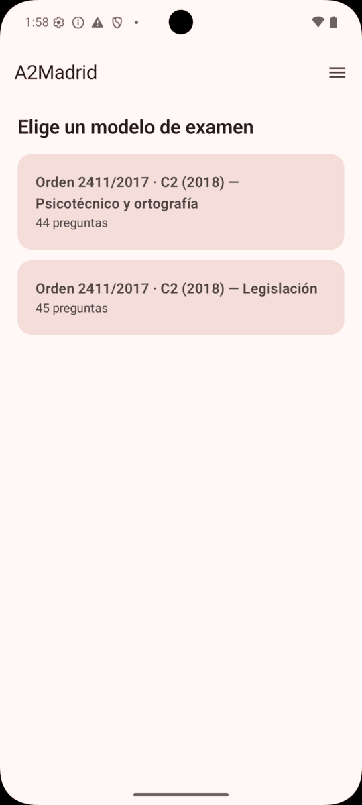
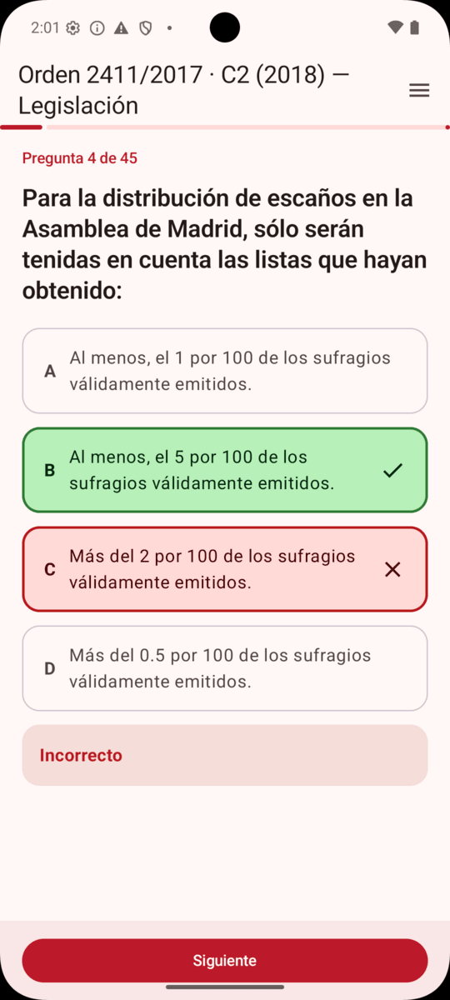
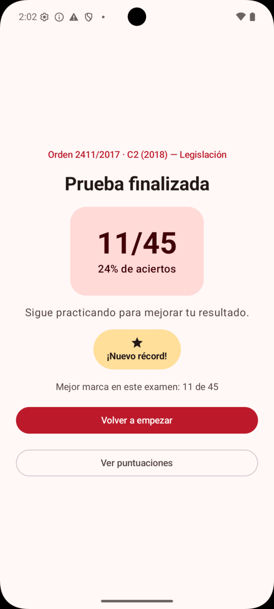

# A2Madrid 📝

App de tests para preparar la oposición de **Auxiliar C2 de la Comunidad de Madrid**: eliges un
modelo, respondes preguntas de opción múltiple, recibes corrección y explicación al instante, y al
terminar ves tu puntuación, el desglose pregunta a pregunta y un historial de marcas.

La app recuerda lo que fallaste: desde el resultado —o días después, desde el historial— puedes
lanzar un test compuesto **solo por las preguntas que fallaste** en un intento concreto.

Cada sesión baraja las preguntas y la posición de las opciones, para que repetir un modelo siga
enseñando en vez de premiar el «era la tercera».

> 🎁 **Esto es un regalo** para todas las personas que están preparando esta oposición. Úsalo
> libremente: sin registro, sin anuncios y sin coste.

Además forma parte de **mi portafolio** como desarrollador
([leonardomanuelmendez.github.io](https://leonardomanuelmendez.github.io/)): está construido con
**Kotlin Multiplatform + Compose Multiplatform** para demostrar una misma base de código corriendo
en **web, iOS y Android**.

## La app

| Elige un modelo | Corrección al instante | Resultado y récord |
|:---:|:---:|:---:|
|  |  |  |

## Cómo usarla

- **Web**: ábrela en el navegador (cualquier dispositivo: móvil, tablet u ordenador).
- **Android**: descarga el APK e instálalo directamente, sin pasar por Google Play.

(Los enlaces de descarga y la web se publican en la landing del proyecto.)

## Tecnología

- **Kotlin Multiplatform** (Kotlin 2.3.20) · módulo único `composeApp` con source sets
  `commonMain` / `androidMain` / `wasmJsMain`.
- **Compose Multiplatform 1.10.3** + Material 3 (UI 100 % compartida entre plataformas).
- **Arquitectura**: Clean Architecture + MVVM + UDF (`presentation → domain ← data`).
- **Navegación**: Compose Navigation multiplataforma (rutas type-safe).
- **DI**: Koin · **Asíncrono**: Coroutines/Flow.
- **Persistencia** (`ScoreStorage`): SharedPreferences (Android) · NSUserDefaults (iOS) ·
  localStorage (Web).
- **Plataformas**: Android ✅ · Web/wasmJs ✅ · iOS ✅ (código + framework verificado en CI; el
  `.xcodeproj` ejecutable se genera en un Mac).
- **CI**: GitHub Actions (`.github/workflows/ci.yml`) — Android (build+test), Web (compile) e
  iOS (framework en runner macOS).
- **Despliegue**: en cada push a `main`, la web va a Firebase Hosting y el APK firmado a GitHub
  Releases. Sin tiendas de por medio — ver [docs/despliegue.md](docs/despliegue.md).

Hecho con 🤍 por [Leonardo Manuel Méndez](https://leonardomanuelmendez.github.io/).
