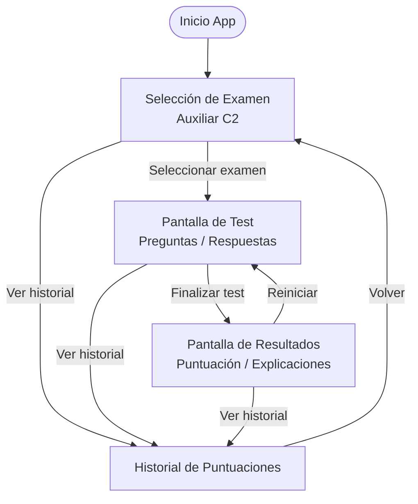
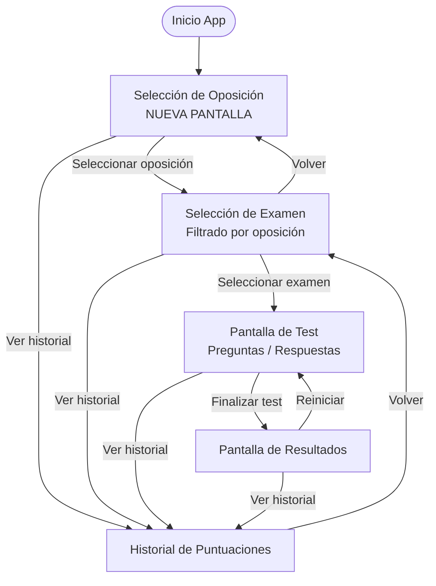

# Wireframes y Flujos de Navegación (A2Madrid)

Este documento detalla el mapa de navegación actual de la aplicación y la propuesta de rediseño para introducir una pantalla de **Selección de Oposición** previa a la selección de examen.

---

## 1. Mapas de Flujo (Navegación)

### A. Flujo de Navegación Actual
En la versión actual, el usuario entra directamente a la pantalla de selección de exámenes, asumiendo únicamente la oposición de Auxiliar C2 de la Comunidad de Madrid.



### B. Nuevo Flujo de Navegación Propuesto
Con el cambio, el flujo de entrada se desplaza un nivel hacia atrás para permitir la elección de la oposición. La pantalla de selección de examen mostrará únicamente los exámenes correspondientes a la oposición elegida.



---

## 2. Wireframes de Pantalla

A continuación se modelan los esquemas visuales en modo móvil de las pantallas involucradas.

### Pantalla 1: Selección de Oposición (Nueva)
Esta pantalla es el nuevo punto de entrada de la aplicación.

```text
┌────────────────────────────────────────┐
│  A2Madrid 📝                           │
├────────────────────────────────────────┤
│                                        │
│  ¿Qué oposición deseas preparar?       │
│                                        │
│  ┌──────────────────────────────────┐  │
│  │ 💼 Auxiliar Administrativo (C2)  │  │
│  │    Comunidad de Madrid           │  │
│  └──────────────────────────────────┘  │
│                                        │
│  ┌──────────────────────────────────┐  │
│  │ 📄 Administrativo (C1)           │  │
│  │    Comunidad de Madrid           │  │
│  └──────────────────────────────────┘  │
│                                        │
│                                        │
├────────────────────────────────────────┤
│  [🏆 Historial Global]                 │
└────────────────────────────────────────┘
```

### Pantalla 2: Selección de Examen (Modificada)
Esta pantalla ahora mostrará una cabecera dinámica con la oposición seleccionada y un botón de retroceso (`←`) para cambiar de oposición.

```text
┌────────────────────────────────────────┐
│  ← Auxiliar Administrativo (C2)        │
├────────────────────────────────────────┤
│  Exámenes disponibles:                 │
│                                        │
│  ┌──────────────────────────────────┐  │
│  │ 📝 Modelo de Examen 2024         │  │
│  │    30 preguntas · Sin límite     │  │
│  └──────────────────────────────────┘  │
│                                        │
│  ┌──────────────────────────────────┐  │
│  │ 📝 Simulacro General Tema 1-5     │  │
│  │    20 preguntas · Sin límite     │  │
│  └──────────────────────────────────┘  │
│                                        │
├────────────────────────────────────────┤
│  [🏆 Historial de la Oposición]        │
└────────────────────────────────────────┘
```

---

## 3. Propagación de Estado y Rutas

Para dar soporte a este flujo a nivel de código en Compose Navigation, se requerirán los siguientes cambios en las rutas del sistema:

| Ruta de Navegación | Tipo / Argumentos | Propósito |
| :--- | :--- | :--- |
| `OppositionSelectionRoute` | `data object` | **(Nueva)** Pantalla de inicio para elegir oposición. |
| `ExamSelectionRoute` | `data class(val oppositionId: String)` | **(Modificada)** Recibe el ID de la oposición para filtrar los exámenes a renderizar. |
| `QuizRoute` | `data class(val examId: String)` | Mantiene su funcionamiento (carga preguntas por ID). |
| `ResultRoute` | `data class(...)` | Mantiene su funcionamiento. |
| `ScoreHistoryRoute` | `data class(val oppositionId: String?)` | **(Opcional / Modificada)** Filtra las puntuaciones por la oposición actual o muestra el historial global. |

---

## 4. Preguntas Abiertas

1. **¿Qué oposiciones de inicio vamos a ofrecer en la nueva pantalla?** 
   * De momento, ¿solo existirá "Auxiliar C2" y dejaremos preparados los mocks/estructuras para "Administrativo C1" u otras oposiciones, o tienes el banco de preguntas listo para otra oposición?
2. **Historial de puntuaciones:** 
   * ¿El historial de puntuaciones debe ser global (muestra todas las notas mezcladas) o debe filtrarse por la oposición que el usuario está estudiando?
